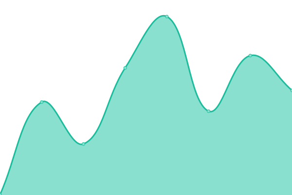

# [📈 Live Status](https://western-social.github.io/monitoring): <!--live status--> **🟩 All systems operational**

This repository contains the open-source uptime monitor and status page for [western.social](https://western.social), powered by [Upptime](https://github.com/upptime/upptime).

With [Upptime](https://upptime.js.org), you can get your own unlimited and free uptime monitor and status page, powered entirely by a GitHub repository. We use [Issues](https://github.com/western-social/monitoring/issues) as incident reports, [Actions](https://github.com/western-social/monitoring/actions) as uptime monitors, and [Pages](https://western-social.github.io/monitoring) for the status page.

<!--start: status pages-->
<!-- This summary is generated by Upptime (https://github.com/upptime/upptime) -->
<!-- Do not edit this manually, your changes will be overwritten -->
<!-- prettier-ignore -->
| URL | Status | History | Response Time | Uptime |
| --- | ------ | ------- | ------------- | ------ |
|  [Google](https://www.google.com) | 🟩 Up | [google.yml](https://github.com/western-social/monitoring/commits/HEAD/history/google.yml) | 

 118ms
     
 | 

<a href="https://western-social.github.io/monitoring/history/google">100.00%</a>
    

|  [az.social](https://az.social) | 🟩 Up | [az-social.yml](https://github.com/western-social/monitoring/commits/HEAD/history/az-social.yml) | 

 671ms
     
 | 

<a href="https://western-social.github.io/monitoring/history/az-social">21.13%</a>
    

|  [ca.social](https://ca.social) | 🟩 Up | [ca-social.yml](https://github.com/western-social/monitoring/commits/HEAD/history/ca-social.yml) | 

 559ms
     
 | 

<a href="https://western-social.github.io/monitoring/history/ca-social">21.13%</a>
    

|  [co.social](https://co.social) | 🟩 Up | [co-social.yml](https://github.com/western-social/monitoring/commits/HEAD/history/co-social.yml) | 

 379ms
     
 | 

<a href="https://western-social.github.io/monitoring/history/co-social">21.13%</a>
    

|  [tx.social](https://tx.social) | 🟩 Up | [tx-social.yml](https://github.com/western-social/monitoring/commits/HEAD/history/tx-social.yml) | 

 385ms
     
 | 

<a href="https://western-social.github.io/monitoring/history/tx-social">21.13%</a>
    

|  [wa.social](https://wa.social) | 🟩 Up | [wa-social.yml](https://github.com/western-social/monitoring/commits/HEAD/history/wa-social.yml) | 

 419ms
     
 | 

<a href="https://western-social.github.io/monitoring/history/wa-social">21.13%</a>
    

<!--end: status pages-->

[**Visit our status website →**](https://western-social.github.io/monitoring)

## 📄 License

- Powered by: [Upptime](https://github.com/upptime/upptime)
- Code: [MIT](./LICENSE) © [western.social](https://western.social)
- Data in the `./history` directory: [Open Database License](https://opendatacommons.org/licenses/odbl/1-0/)
